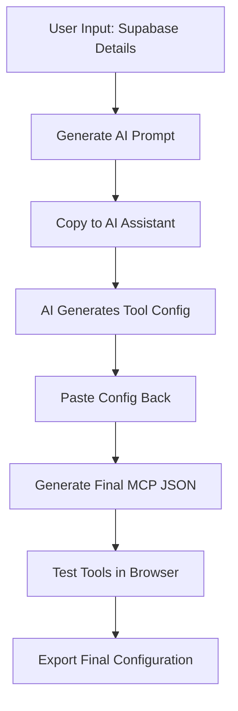

# SupaMCP Frontend Web Application - Overview & Architecture

## 🎯 Application Purpose

**SupaMCP** is a web application that simplifies the creation of MCP (Model Context Protocol) tool configurations for Supabase databases. It bridges the gap between database discovery and AI-powered tool generation by providing an intuitive interface for users to generate, test, and deploy MCP configurations.

Keep the page compact, use modern font and smaller font size so user can see a lot , for forms if we can show mutiple fields in one row then do that, use shadcn components

## 🏗️ Application Architecture

### Core Workflow


## 📋 Main Application Features

### 1. **Project Setup Interface**
- **Supabase Configuration Input**
  - Project URL validation
  - Anonymous key input with security masking
  - Project name which user enters
  - Enter details on what functionality of data base should be convereted as tools

### 2. **AI Prompt Generation**

- **Prompt Customization**
  - Target AI platform selection (Claude, Cursor, Bolt)
  - Show the prompt they can use
  - paste the tools json generated via the ai platform

### 3. **Configuration Management**

- **Final MCP Generation**
  - Server configuration generation

### 4. **Integrated Testing Environment**
- **Live API Testing**
  - prompt user for test user email and pwd
  - Browser-based Supabase client initialization
  - Real-time tool execution wiht supabase js client in the browser


## 🎨 User Interface Design

### Layout Structure
```
┌─────────────────────────────────────────────────────────────┐
│                    SupaMCP Header                           │
├─────────────────────────────────────────────────────────────┤
│  Step Navigation: [1] Setup → [2] Generate → [3] Test      │
├─────────────────────────────────────────────────────────────┤
│                                                             │
│                    Main Content Area                        │
│                   (Step-specific UI)                       │
│                                                             │
├─────────────────────────────────────────────────────────────┤
│  Actions: [Back] [Next] [Copy Prompt] [Export Config]      │
└─────────────────────────────────────────────────────────────┘
```

### Key Dependencies
use supabase js cliecnt and monacodeitor

## 📄 Page Structure & Navigation

### main header
Will have app name and a button with text how it works where we will show the details in a pop up modal and embeded youtube video if users want, one more button saying how to use that will show pop up with how to use the app and youtube video embedded and button linking to github repo

### 1. **Setup Section** 
**Purpose**: Collect Supabase project details and functionality requirements

**Key Features**:
- **Inline Help System**: Each field has help with links and instructions as tool tip
- **Privacy Assurance**: Clear messaging that this is frontend-only, no data stored/sent externally
- **Step-by-step Guidance**: Visual indicators showing where to find each piece of information
- Ensure the page is not getting too long and we are gracefully showing all information and fields in the singel screen view

**Form Fields with Help Show these details a tool tips**:

**Supabase Project URL**
- Input field with validation
- Help section: "Find this in your Supabase dashboard → Settings → API → Project URL"
- Link to Supabase documentation
- Example: `https://your-project.supabase.co`

**Anonymous Key**
- Masked input field for security
- Help section: "Found in Supabase dashboard → Settings → API → anon/public key"
- Privacy note: "🔒 This app runs entirely in your browser. Your keys are never stored or sent to our servers."
- Warning about using anon key, not service role key

**Supabase Project Name**
- Simple text input
- Help section: "Use the same name as in your Supabase dashboard for easy identification"
- mandatory would be used in the prompt

**Functionality Requirements**
- Large text area for user to describe desired tools
- Help section: "Describe what you want to do with your data (e.g., 'user management', 'blog posts', 'analytics dashboard')"
- Placeholder text with common use cases, the copy should be focused on how a user will tell about functionaliteis they want to be converted as tools
- option to move to next step

### 2. **Generate Section** 
**Purpose**: Generate AI prompts and guide users through tool creation process


**Platform Setup Instructions**:

**Bolt (StackBlitz)** ⭐ *Recommended for beginners*
- ✅ **Requirement**: Integrate your Supabase project in Bolt first
- 📋 **Instructions**: "Go to your Bolt project → Add Integration → Supabase → Enter your project details"
- 🔗 **Link**: [Bolt Supabase Integration Guide](https://docs.bolt.new/integrations/supabase)
- ⚡ **What to expect**: Bolt will have direct access to your database and can test tools immediately

**Claude Web/Desktop** ⭐ *Best AI and Testing quality*
- ✅ **Requirement**: Setup Supabase MCP server first
- 📋 **Instructions**: "Install and configure official Supabase MCP server to connect Claude to your database"
- 🔗 **Link**: [Supabase MCP Server Setup](https://github.com/supabase/supabase-mcp)
- ⚡ **What to expect**: Claude will analyze your database and generate optimized tool configurations, you can then add the mcp server created by us in claude to test debug and fix it

**Cursor IDE** ⭐ *For developers*
- ✅ **Requirement**: Setup Supabase MCP server in your development environment
- 📋 **Instructions**: "Configure MCP server in your Cursor project settings"
- 🔗 **Link**: [Cursor MCP Configuration](https://docs.cursor.com/mcp)
- ⚡ **What to expect**: Integrated development experience with real-time database access also for testing the generated mcp server and config 

**Collapsible Step System**: Show each step as virtical list where depending on which step you are that step ui is shown kinda like side nav menue
1. **Choose Platform** (after user selection with highlight on which plaform used)  after selection copy prompt should be shownw tih insturctions
2. **Copy Prompt** (should collapse when user clicks next section)  moved to left after user copies
3. **Generate Config** ( show show instructions about how to copy the prompt based on the platform type and use it) shows instructions and option to add the generated tool config, click on import and test which will take the suer to test section

**how the prompt would be generated**
WE should add the project name and users requirements in the prompt with detailed instructions, i am attaching a doc which we can use as prompt templates

**How final mcp config would be generated**
{
  "mcpServers": {
    "supabase-<add the project name>": {
      "command": "npx",
      "args": [
        "@vivek100/supamcpgenerator@latest",
        "--url", "< link to the supabase project given by the user>",
        "--anon-key", "< supabase annon key>",
        "--email", "<user's email this we will not update will be updated by the end user using the genrated mcp server>",
        "--password", "<user's pwd this we will not update will be updated by the end user using the genrated mcp server>", 
        "--tools-json", "<stringified array data of all the tools and their configs which user will paste in the generate config step, we shoould pluf it here >"
      ]
    }
  }
}

### 3. **Test section**
**Purpose**: Test generated MCP tools and view/export final configuration

**Page Flow**:

**Left Panel Configuration Review Left panel** we be on the left
- **Expanded Configuration Display**: Full MCP json configuration shown with syntax highlighting
- **Summary Stats**: "X tools generated, Y tables covered, Z functions included"
- **Action Buttons**: 
  - `[Copy]` - where user will see ui where they can see a copy button too next
  - `[Export Now]` - Skip testing and export immediately
  - this section will be expande

**Right panel View, edit and test tool right panel** (After credentials entered)
- **Tool table**: Shown in a table form, with options to select deselect, edit where that specific tool configuration can be edited, and then test
- Will be show selected if it is part of the final MCP config json, deselect will remove from the final config
- edit will show just that tools json which user can edit as a modal and close after changes are saved or cancelled
- test will show input params and option to test and view the results, will call supabase js client , will be shown in a modal which user can close, in the modal we will show the tool name description, all the input values the user can configure to test, more details on which field to show and how to connect to supabase js are present in the testing tool doc
- show all these as options once a tool is tested, once a tool is tested we can show status on the list tested, not tested, added, removed so it will be a pair of its status in final config and the testing status
- if the supabase client is not intialised with useremail and pwd, show a modal with user email pwd with isnturction how this will be used to test and is not stored anywhere
- text based buttons so user knows what to do and show text like check box means to inclued or not better to use a table so we can show the table name and we can show the test and setting as modal popups

On top of the tool table we show option to setup authentication for testing


  ```
  ┌─────────────────────────────────────────────┐
  │ 🔐 Test Authentication Required             │
  ├─────────────────────────────────────────────┤
  │                                             │
  │ To test tools safely, provide           │
  │ authentication credentials:                 │
  │                                             │
  │ Email: [test@example.com           ]        │
  │ Password: [••••••••••••••••••••••• ]        │
  │                                             │
  │ ℹ️  These are only used for browser testing │
  │    and are not sent to any servers         │
  │                                             │
  │           [ Enable Testing ]                │
  └─────────────────────────────────────────────┘
  ```

**User Instructions**:
- **Security Notice**: "All testing happens in your browser. No data is sent to external servers."
- **Error Guidance**: "If tests fail, check RLS policies and table permissions in your Supabase dashboard."

**Key Features**:
- Configuration visibility control
- Browser-only testing environment
- Real-time tool execution and validation


Note: add an option to reset the whole page, should be on the top menue bar if user wants to create new mcp server if not we should persist the form values unless user refreshes