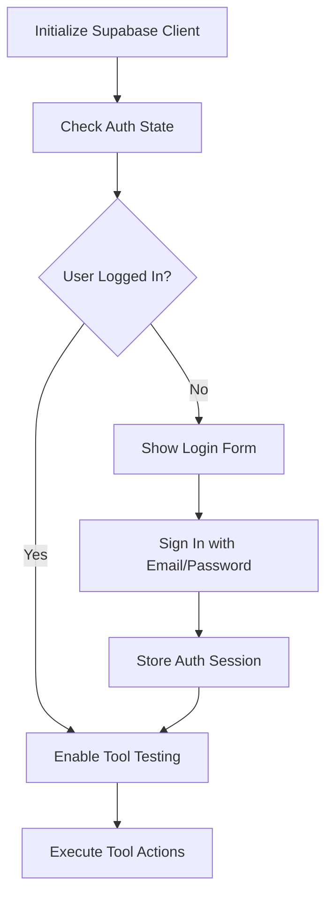

# SupaMCP Testing Tool - Detailed Technical Implementation

## 🎯 Purpose & Overview

### What is the SupaMCP Testing Tool?
The SupaMCP Testing Tool is a **browser-based web application** that allows users to test and validate MCP (Model Context Protocol) tool configurations before deploying them to actual MCP servers. It simulates the MCP server environment using the Supabase JavaScript SDK directly in the browser.

### Why This Tool Exists
1. **Validation Before Deployment**: Test MCP tools without setting up a full MCP server
2. **Configuration Debugging**: Identify issues in tool configurations before they reach production
3. **Real Data Testing**: Execute actual Supabase operations with real project data
4. **Security Verification**: Test RLS policies and authentication flows safely
5. **Performance Testing**: Measure query execution times and optimize configurations

### How It Works - The Complete Flow

#### 1. Configuration Import
The app receives **MCP tool configuration JSON** (generated by AI tools like Claude, Cursor, or Bolt) that looks like this:
```json
{
  "name": "list_users",
  "description": "List users with filtering",
  "inputSchema": {
    "type": "object",
    "properties": {
      "role": { "type": "string" },
      "limit": { "type": "number" }
    }
  },
  "action": {
    "type": "select",
    "table": "users",
    "columns": ["id", "email", "role", "created_at"],
    "advancedFilters": [
      {
        "column": "role",
        "operation": "eq",
        "value": "{{role}}"
      }
    ],
    "limit": "{{limit}}"
  }
}
```

#### 2. Dynamic Form Generation
The app reads the `inputSchema` and creates dynamic forms for each tool, allowing users to input test parameters.

#### 3. Action Execution
When a user tests a tool, the app:
- Takes the `action` configuration
- Replaces template variables (`{{role}}`, `{{limit}}`) with user input
- Converts the action into appropriate Supabase JavaScript SDK calls
- Executes the operation against the real Supabase project
- Returns formatted results

#### 4. Real Supabase Integration
Unlike mock testing, this tool connects to your actual Supabase project using:
- **Project URL**: Your Supabase project's API endpoint
- **Anonymous Key**: For client-side authentication
- **User Credentials**: For testing RLS policies and authenticated operations

### Key Features for AI Implementation

#### Configuration-Driven Architecture
The entire app is driven by the MCP tool configuration JSON. AI tools should understand that:

1. **Input Schema Drives UI**: The `inputSchema` property automatically generates form fields
2. **Action Config Drives Execution**: The `action` property defines how Supabase calls are made
3. **Template Variables**: Any `{{variable}}` in the action gets replaced with user input
4. **Validation**: Both input validation and response validation happen automatically

#### Supported Action Types
The app can handle all MCP action types that map to Supabase operations:
- `select`: Database queries with filtering, sorting, pagination
- `insert`: Creating new records
- `update`: Modifying existing records
- `delete`: Removing records
- `upsert`: Insert or update operations
- `rpc`: Calling PostgreSQL functions
- `edgeFunction`: Invoking Supabase Edge Functions

## 🔑 Supabase Authentication & Client Setup

### Setting Up Supabase Client
```typescript
import { createClient, SupabaseClient } from '@supabase/supabase-js';

interface SupabaseConfig {
  url: string;
  anonKey: string;
}

class SupabaseTestClient {
  private client: SupabaseClient;
  
  constructor(config: SupabaseConfig) {
    this.client = createClient(config.url, config.anonKey, {
      auth: {
        autoRefreshToken: true,
        persistSession: true
      }
    });
  }

  // Get current user
  async getCurrentUser() {
    const { data: { user }, error } = await this.client.auth.getUser();
    if (error) throw error;
    return user;
  }

  // Sign in with email/password
  async signIn(email: string, password: string) {
    const { data, error } = await this.client.auth.signInWithPassword({
      email,
      password
    });
    if (error) throw error;
    return data;
  }

  // Sign out
  async signOut() {
    const { error } = await this.client.auth.signOut();
    if (error) throw error;
  }
}
```

### Authentication Flow


## 🤖 AI Implementation Guide

### How AI Should Build This App

#### 1. Configuration Parser
The app needs to parse MCP tool configurations and extract key information:

```typescript
interface MCPToolConfig {
  name: string;
  description: string;
  inputSchema: JSONSchema7;  // JSON Schema for form generation
  action: ToolAction;        // Supabase operation configuration
}

class ConfigurationParser {
  static parseTools(configJson: MCPToolConfig[]): ParsedTool[] {
    return configJson.map(tool => ({
      name: tool.name,
      description: tool.description,
      formFields: this.extractFormFields(tool.inputSchema),
      action: this.validateAction(tool.action),
      requiredParams: this.getRequiredParams(tool.inputSchema)
    }));
  }

  static extractFormFields(schema: JSONSchema7): FormField[] {
    const fields: FormField[] = [];
    
    if (schema.properties) {
      Object.entries(schema.properties).forEach(([key, prop]) => {
        if (typeof prop === 'object') {
          fields.push({
            name: key,
            type: prop.type || 'string',
            required: schema.required?.includes(key) || false,
            description: prop.description,
            enum: prop.enum,
            default: prop.default
          });
        }
      });
    }
    
    return fields;
  }
}
```

#### 2. Template Variable Resolution
Critical functionality for replacing `{{variables}}` in action configurations:

```typescript
class TemplateResolver {
  static resolveAction(
    action: ToolAction, 
    userInputs: Record<string, any>
  ): ToolAction {
    // Deep clone the action to avoid mutations
    const resolvedAction = JSON.parse(JSON.stringify(action));
    
    // Recursively replace template variables
    return this.resolveObject(resolvedAction, userInputs);
  }

  private static resolveObject(obj: any, inputs: Record<string, any>): any {
    if (typeof obj === 'string') {
      // Replace {{variable}} with actual values
      return obj.replace(/\{\{(\w+)\}\}/g, (match, varName) => {
        return inputs[varName] !== undefined ? inputs[varName] : match;
      });
    }
    
    if (Array.isArray(obj)) {
      return obj.map(item => this.resolveObject(item, inputs));
    }
    
    if (typeof obj === 'object' && obj !== null) {
      const resolved: any = {};
      for (const [key, value] of Object.entries(obj)) {
        resolved[key] = this.resolveObject(value, inputs);
      }
      return resolved;
    }
    
    return obj;
  }
}
```

#### 3. Action-to-Supabase Conversion
The core logic that converts MCP actions to Supabase SDK calls:

```typescript
class ActionConverter {
  static convertToSupabaseQuery(
    action: ToolAction,
    supabaseClient: SupabaseClient
  ): any {
    switch (action.type) {
      case 'select':
        return this.buildSelectQuery(action, supabaseClient);
      case 'insert':
        return this.buildInsertQuery(action, supabaseClient);
      case 'update':
        return this.buildUpdateQuery(action, supabaseClient);
      // ... other action types
    }
  }

  private static buildSelectQuery(action: SelectAction, client: SupabaseClient) {
    // Start with base query
    let query = client
      .from(action.table)
      .select(action.columns?.join(',') || '*');

    // Apply basic filters
    if (action.filters) {
      Object.entries(action.filters).forEach(([column, value]) => {
        query = query.eq(column, value);
      });
    }

    // Apply advanced filters
    if (action.advancedFilters) {
      action.advancedFilters.forEach(filter => {
        switch (filter.operation) {
          case 'eq':
            query = query.eq(filter.column, filter.value);
            break;
          case 'gt':
            query = query.gt(filter.column, filter.value);
            break;
          // ... other operations
        }
      });
    }

    // Apply ordering
    if (action.orderBy) {
      action.orderBy.forEach(order => {
        query = query.order(order.column, { 
          ascending: order.ascending 
        });
      });
    }

    // Apply pagination
    if (action.limit) {
      query = query.limit(action.limit);
    }

    return query;
  }
}
```

#### 4. Form Generation from JSON Schema
Dynamic form creation based on the `inputSchema`:

```typescript
const DynamicForm: React.FC<{
  schema: JSONSchema7;
  onSubmit: (values: Record<string, any>) => void;
}> = ({ schema, onSubmit }) => {
  const [formData, setFormData] = useState<Record<string, any>>({});

  const renderField = (fieldName: string, fieldSchema: any) => {
    const isRequired = schema.required?.includes(fieldName);
    
    switch (fieldSchema.type) {
      case 'string':
        if (fieldSchema.enum) {
          return (
            <Select
              value={formData[fieldName] || ''}
              onValueChange={(value) => 
                setFormData(prev => ({ ...prev, [fieldName]: value }))
              }
            >
              {fieldSchema.enum.map((option: string) => (
                <SelectItem key={option} value={option}>
                  {option}
                </SelectItem>
              ))}
            </Select>
          );
        }
        return (
          <Input
            type="text"
            value={formData[fieldName] || ''}
            onChange={(e) => 
              setFormData(prev => ({ ...prev, [fieldName]: e.target.value }))
            }
            placeholder={fieldSchema.description}
            required={isRequired}
          />
        );
        
      case 'number':
        return (
          <Input
            type="number"
            value={formData[fieldName] || ''}
            onChange={(e) => 
              setFormData(prev => ({ ...prev, [fieldName]: Number(e.target.value) }))
            }
            required={isRequired}
          />
        );
        
      // ... other field types
    }
  };

  return (
    <form onSubmit={(e) => { e.preventDefault(); onSubmit(formData); }}>
      {schema.properties && Object.entries(schema.properties).map(([fieldName, fieldSchema]) => (
        <div key={fieldName} className="mb-4">
          <Label htmlFor={fieldName}>
            {fieldName}
            {schema.required?.includes(fieldName) && ' *'}
          </Label>
          {renderField(fieldName, fieldSchema)}
          {fieldSchema.description && (
            <p className="text-sm text-gray-600 mt-1">
              {fieldSchema.description}
            </p>
          )}
        </div>
      ))}
      <Button type="submit">Test Tool</Button>
    </form>
  );
};
```

## 🛠️ Tool Action Execution

### Action Types & Interfaces
```typescript
// Core action types supported by Supabase client
type ActionType = 
  | 'select' 
  | 'insert' 
  | 'update' 
  | 'delete' 
  | 'upsert'
  | 'rpc'
  | 'edgeFunction';

// Base action interface
interface ToolAction {
  type: ActionType;
  table?: string;
  function?: string;
  filters?: Record<string, any>;
  advancedFilters?: AdvancedFilter[];
  orConditions?: OrCondition[];
  returning?: string[];
  select?: string;
}

// Advanced filtering options
interface AdvancedFilter {
  column: string;
  operation: 'eq' | 'neq' | 'gt' | 'gte' | 'lt' | 'lte' | 'like' | 'ilike' 
    | 'is' | 'in' | 'contains' | 'containedBy' | 'overlaps' | 'match';
  value: any;
  referencedTable?: string;
}

// OR condition support
interface OrCondition {
  conditions: string;
  referencedTable?: string;
}
```

### Tool Execution Engine
```typescript
class ToolExecutor {
  private supabase: SupabaseClient;

  constructor(config: SupabaseConfig) {
    this.supabase = createClient(config.url, config.anonKey);
  }

  async executeAction(action: ToolAction, params: Record<string, any>) {
    try {
      // 1. Parameter validation
      this.validateParams(action, params);

      // 2. Template resolution
      const resolvedAction = this.resolveTemplates(action, params);

      // 3. Execute based on action type
      switch (resolvedAction.type) {
        case 'select':
          return await this.executeSelect(resolvedAction);
        case 'insert':
          return await this.executeInsert(resolvedAction);
        case 'update':
          return await this.executeUpdate(resolvedAction);
        case 'delete':
          return await this.executeDelete(resolvedAction);
        case 'upsert':
          return await this.executeUpsert(resolvedAction);
        case 'rpc':
          return await this.executeRPC(resolvedAction);
        case 'edgeFunction':
          return await this.executeEdgeFunction(resolvedAction);
      }
    } catch (error) {
      throw this.formatError(error);
    }
  }

  // Example of SELECT execution with full Supabase features
  private async executeSelect(action: SelectAction) {
    let query = this.supabase
      .from(action.table)
      .select(action.columns?.join(',') || '*', {
        count: action.count,
        head: action.head
      });

    // Apply filters
    query = this.applyFilters(query, action);
    
    // Apply ordering
    if (action.orderBy) {
      for (const order of action.orderBy) {
        query = query.order(order.column, {
          ascending: order.ascending,
          nullsFirst: order.nullsFirst,
          foreignTable: order.referencedTable
        });
      }
    }

    // Apply pagination
    if (action.limit) {
      query = query.limit(action.limit);
    }
    if (action.offset) {
      query = query.range(
        action.offset,
        action.offset + (action.limit || 10) - 1
      );
    }

    // Execute with response modifiers
    let result;
    if (action.single) {
      result = await query.single();
    } else if (action.maybeSingle) {
      result = await query.maybeSingle();
    } else {
      result = await query;
    }

    return this.formatResponse(result);
  }
}
```

## 🔍 Advanced Query Features

### Filter Application
```typescript
class ToolExecutor {
  private applyFilters(query: any, action: ToolAction): any {
    // 1. Basic Filters (eq operations)
    if (action.filters) {
      Object.entries(action.filters).forEach(([column, value]) => {
        query = query.eq(column, value);
      });
    }

    // 2. Advanced Filters
    if (action.advancedFilters) {
      action.advancedFilters.forEach(filter => {
        const { column, operation, value, referencedTable } = filter;
        const options = referencedTable ? { foreignTable: referencedTable } : undefined;

        switch (operation) {
          case 'eq': return query.eq(column, value, options);
          case 'neq': return query.neq(column, value, options);
          case 'gt': return query.gt(column, value, options);
          case 'gte': return query.gte(column, value, options);
          case 'lt': return query.lt(column, value, options);
          case 'lte': return query.lte(column, value, options);
          case 'like': return query.like(column, value, options);
          case 'ilike': return query.ilike(column, value, options);
          case 'is': return query.is(column, value, options);
          case 'in': return query.in(column, value, options);
          case 'contains': return query.contains(column, value, options);
          case 'overlaps': return query.overlaps(column, value, options);
          case 'match': return query.match(value, options);
        }
      });
    }

    // 3. OR Conditions
    if (action.orConditions) {
      action.orConditions.forEach(condition => {
        if (condition.referencedTable) {
          query = query.or(condition.conditions, { 
            foreignTable: condition.referencedTable 
          });
        } else {
          query = query.or(condition.conditions);
        }
      });
    }

    return query;
  }
}
```

### Response Formatting
```typescript
class ToolExecutor {
  private formatResponse(result: any) {
    if (result.error) {
      return {
        success: false,
        error: {
          code: result.error.code,
          message: result.error.message,
          details: result.error.details
        }
      };
    }

    return {
      success: true,
      data: result.data,
      count: result.count,
      status: result.status,
      statusText: result.statusText
    };
  }

  private formatError(error: any) {
    // Handle common Supabase error patterns
    if (error?.message?.includes('JWT expired')) {
      return {
        code: 'AUTH_ERROR',
        message: 'Your session has expired. Please sign in again.',
        details: error
      };
    }

    if (error?.message?.includes('Row level security')) {
      return {
        code: 'PERMISSION_ERROR',
        message: 'You do not have permission to perform this action.',
        details: error
      };
    }

    return {
      code: 'EXECUTION_ERROR',
      message: error?.message || 'An unknown error occurred',
      details: error
    };
  }
}
```

## 🧪 Testing Different Action Types

### 1. Testing SELECT Operations
```typescript
// Example MCP tool configuration for SELECT
const selectToolConfig = {
  name: "list_users",
  description: "List users with filtering and pagination",
  action: {
    type: "select",
    table: "users",
    columns: ["id", "email", "created_at"],
    advancedFilters: [
      {
        column: "role",
        operation: "eq",
        value: "admin"
      }
    ],
    orderBy: [
      {
        column: "created_at",
        ascending: false
      }
    ],
    limit: 10
  }
};

// Testing the SELECT tool
const testSelect = async () => {
  const executor = new ToolExecutor(supabaseConfig);
  const result = await executor.executeAction(selectToolConfig.action, {});
  console.log('SELECT Result:', result);
};
```

### 2. Testing INSERT Operations
```typescript
// Example MCP tool configuration for INSERT
const insertToolConfig = {
  name: "create_user",
  description: "Create a new user",
  action: {
    type: "insert",
    table: "users",
    values: {
      email: "{{email}}",
      role: "{{role}}",
      created_by: "auth.uid()"  // Special function handling
    },
    returning: ["id", "email", "created_at"]
  }
};

// Testing the INSERT tool
const testInsert = async () => {
  const executor = new ToolExecutor(supabaseConfig);
  const result = await executor.executeAction(insertToolConfig.action, {
    email: "test@example.com",
    role: "user"
  });
  console.log('INSERT Result:', result);
};
```

### 3. Testing RPC Functions
```typescript
// Example MCP tool configuration for RPC
const rpcToolConfig = {
  name: "calculate_stats",
  description: "Calculate user statistics",
  action: {
    type: "rpc",
    function: "get_user_stats",
    args: {
      user_id: "{{user_id}}",
      start_date: "{{start_date}}"
    }
  }
};

// Testing the RPC tool
const testRPC = async () => {
  const executor = new ToolExecutor(supabaseConfig);
  const result = await executor.executeAction(rpcToolConfig.action, {
    user_id: "123",
    start_date: "2024-01-01"
  });
  console.log('RPC Result:', result);
};
```

### 4. Testing Edge Functions
```typescript
// Example MCP tool configuration for Edge Function
const edgeFunctionConfig = {
  name: "process_image",
  description: "Process an uploaded image",
  action: {
    type: "edgeFunction",
    function: "image-processor",
    body: {
      imageUrl: "{{url}}",
      options: {
        resize: true,
        width: 800
      }
    }
  }
};

// Testing the Edge Function
const testEdgeFunction = async () => {
  const executor = new ToolExecutor(supabaseConfig);
  const result = await executor.executeAction(edgeFunctionConfig.action, {
    url: "https://example.com/image.jpg"
  });
  console.log('Edge Function Result:', result);
};
```

### Special Cases & Error Handling

#### 1. Handling Special PostgreSQL Functions
```typescript
class ToolExecutor {
  private async processSpecialValues(values: any): Promise<any> {
    if (typeof values === 'string') {
      switch (values) {
        case 'auth.uid()':
          const { data: { user } } = await this.supabase.auth.getUser();
          return user?.id;
        case 'now()':
          return new Date().toISOString();
        default:
          return values;
      }
    }

    if (Array.isArray(values)) {
      return Promise.all(values.map(v => this.processSpecialValues(v)));
    }

    if (typeof values === 'object' && values !== null) {
      const processed: any = {};
      for (const [key, value] of Object.entries(values)) {
        processed[key] = await this.processSpecialValues(value);
      }
      return processed;
    }

    return values;
  }
}
```

#### 2. Handling RLS Policies
```typescript
// Example of testing with different auth states
const testWithRLS = async () => {
  const executor = new ToolExecutor(supabaseConfig);
  
  try {
    // Test without auth (should fail if RLS enabled)
    await executor.executeAction(selectToolConfig.action, {});
  } catch (error) {
    console.log('Expected RLS error:', error);
  }

  // Sign in and test again
  await executor.supabase.auth.signInWithPassword({
    email: 'test@example.com',
    password: 'password123'
  });

  // Now should work if user has correct permissions
  const result = await executor.executeAction(selectToolConfig.action, {});
  console.log('Authenticated result:', result);
};
```

## 📋 Practical Testing Guidelines

### 1. Testing Setup Checklist
```typescript
interface TestingSetup {
  // 1. Supabase Configuration
  supabaseConfig: {
    url: string;      // From Project Settings -> API
    anonKey: string;  // From Project Settings -> API (anon/public key)
  };

  // 2. Test User Credentials
  testUser: {
    email: string;    // Valid user email in your Supabase project
    password: string; // User's password
  };

  // 3. Test Data Requirements
  testData: {
    required: boolean;
    tables: string[];
    seedScripts?: string[];
  };

  // 4. RLS Policy Verification
  rlsPolicies: {
    table: string;
    policies: {
      name: string;
      operation: 'SELECT' | 'INSERT' | 'UPDATE' | 'DELETE';
      verified: boolean;
    }[];
  }[];
}
```

### 2. Testing Best Practices

#### Order of Operations
1. **Authentication First**
   ```typescript
   const testTools = async () => {
     const executor = new ToolExecutor(supabaseConfig);
     
     // Always authenticate first
     await executor.supabase.auth.signInWithPassword(testUser);
     
     // Then test tools in order:
     // 1. Read operations (SELECT)
     await testSelect();
     
     // 2. Create operations (INSERT)
     await testInsert();
     
     // 3. Update operations
     await testUpdate();
     
     // 4. Delete operations (cleanup)
     await testDelete();
   };
   ```

#### Error Handling Patterns
```typescript
const safeTestExecution = async (
  executor: ToolExecutor,
  action: ToolAction,
  params: Record<string, any>
) => {
  try {
    const result = await executor.executeAction(action, params);
    console.log(`✅ Success: ${action.type} operation`);
    return result;
  } catch (error) {
    console.error(`❌ Error in ${action.type} operation:`, error);
    
    // Check common issues
    if (error.code === 'PGRST301') {
      console.warn('💡 Hint: RLS policy might be blocking this operation');
    }
    if (error.message?.includes('duplicate key')) {
      console.warn('💡 Hint: Record already exists, consider using upsert');
    }
    
    throw error;
  }
};
```

### 3. Common Testing Scenarios

#### Testing Data Relationships
```typescript
// Example: Testing a tool that involves related tables
const testRelatedData = async () => {
  const executor = new ToolExecutor(supabaseConfig);
  
  // 1. Create parent record
  const parent = await executor.executeAction({
    type: 'insert',
    table: 'departments',
    values: { name: 'Engineering' },
    returning: ['id']
  }, {});
  
  // 2. Create child record with relationship
  const child = await executor.executeAction({
    type: 'insert',
    table: 'employees',
    values: { 
      name: 'John Doe',
      department_id: parent.data[0].id
    }
  }, {});
  
  // 3. Test fetching with joins
  const result = await executor.executeAction({
    type: 'select',
    table: 'employees',
    columns: ['name', 'departments(name)'],
    filters: { id: child.data[0].id }
  }, {});
};
```

#### Testing with Special Data Types
```typescript
// Example: Testing JSON operations
const testJsonOperations = async () => {
  const executor = new ToolExecutor(supabaseConfig);
  
  // Insert JSON data
  await executor.executeAction({
    type: 'insert',
    table: 'profiles',
    values: {
      user_id: '{{user_id}}',
      metadata: {
        preferences: {
          theme: 'dark',
          notifications: true
        }
      }
    }
  }, { user_id: '123' });
  
  // Query using JSON operators
  await executor.executeAction({
    type: 'select',
    table: 'profiles',
    advancedFilters: [{
      column: 'metadata->preferences->theme',
      operation: 'eq',
      value: 'dark'
    }]
  }, {});
};
```

### 4. Validation & Verification

#### Parameter Validation
```typescript
const validateToolParams = (
  params: Record<string, any>,
  requiredParams: string[]
) => {
  const missing = requiredParams.filter(param => {
    const value = params[param];
    return value === undefined || value === null || value === '';
  });
  
  if (missing.length > 0) {
    throw new Error(`Missing required parameters: ${missing.join(', ')}`);
  }
  
  return true;
};
```

#### Response Validation
```typescript
const validateToolResponse = (
  response: any,
  expectedShape: {
    required?: string[];
    type?: 'array' | 'object' | 'value';
    minItems?: number;
  }
) => {
  if (!response.success) {
    throw new Error(`Tool execution failed: ${response.error.message}`);
  }
  
  const data = response.data;
  
  // Check type
  if (expectedShape.type === 'array' && !Array.isArray(data)) {
    throw new Error('Expected array response');
  }
  
  // Check array length
  if (expectedShape.minItems && data.length < expectedShape.minItems) {
    throw new Error(`Expected at least ${expectedShape.minItems} items`);
  }
  
  // Check required fields
  if (expectedShape.required) {
    const missing = expectedShape.required.filter(field => {
      const item = Array.isArray(data) ? data[0] : data;
      return !(field in item);
    });
    
    if (missing.length > 0) {
      throw new Error(`Missing required fields: ${missing.join(', ')}`);
    }
  }
  
  return true;
};
```

## 🔄 Complete Testing Workflow

### How the App Should Work - Step by Step

#### 1. Configuration Import & Validation
```typescript
const TestingApp: React.FC = () => {
  const [toolsConfig, setToolsConfig] = useState<MCPToolConfig[]>([]);
  const [supabaseConfig, setSupabaseConfig] = useState<SupabaseConfig>();
  const [currentTool, setCurrentTool] = useState<string | null>(null);

  const handleConfigImport = (configJson: string) => {
    try {
      const config = JSON.parse(configJson);
      
      // Validate configuration structure
      const validatedTools = ConfigurationParser.parseTools(config);
      setToolsConfig(validatedTools);
      
      // Show success message
      toast.success(`${validatedTools.length} tools loaded successfully`);
    } catch (error) {
      toast.error(`Invalid configuration: ${error.message}`);
    }
  };

  return (
    <div className="container mx-auto p-6">
      {!toolsConfig.length ? (
        <ConfigurationImporter onImport={handleConfigImport} />
      ) : (
        <TestingInterface 
          tools={toolsConfig}
          supabaseConfig={supabaseConfig}
          onConfigChange={setSupabaseConfig}
        />
      )}
    </div>
  );
};
```

#### 2. Supabase Connection Setup
```typescript
const SupabaseSetup: React.FC<{
  onConfigured: (config: SupabaseConfig) => void;
}> = ({ onConfigured }) => {
  const [url, setUrl] = useState('');
  const [anonKey, setAnonKey] = useState('');
  const [isConnecting, setIsConnecting] = useState(false);

  const testConnection = async () => {
    setIsConnecting(true);
    try {
      const client = createClient(url, anonKey);
      
      // Test the connection
      const { data, error } = await client.from('_supabase_migrations').select('*').limit(1);
      
      if (error && !error.message.includes('relation "_supabase_migrations" does not exist')) {
        throw error;
      }
      
      onConfigured({ url, anonKey });
      toast.success('Connected to Supabase successfully!');
    } catch (error) {
      toast.error(`Connection failed: ${error.message}`);
    } finally {
      setIsConnecting(false);
    }
  };

  return (
    <Card className="max-w-md mx-auto">
      <CardHeader>
        <CardTitle>Connect to Supabase</CardTitle>
        <CardDescription>
          Enter your Supabase project details to start testing
        </CardDescription>
      </CardHeader>
      <CardContent>
        <div className="space-y-4">
          <div>
            <Label htmlFor="url">Project URL</Label>
            <Input
              id="url"
              value={url}
              onChange={(e) => setUrl(e.target.value)}
              placeholder="https://your-project.supabase.co"
            />
          </div>
          <div>
            <Label htmlFor="anonKey">Anonymous Key</Label>
            <Input
              id="anonKey"
              type="password"
              value={anonKey}
              onChange={(e) => setAnonKey(e.target.value)}
              placeholder="Your anon/public key"
            />
          </div>
          <Button 
            onClick={testConnection}
            disabled={!url || !anonKey || isConnecting}
            className="w-full"
          >
            {isConnecting ? 'Connecting...' : 'Connect & Test'}
          </Button>
        </div>
      </CardContent>
    </Card>
  );
};
```

#### 3. Tool Testing Interface
```typescript
const ToolTestingInterface: React.FC<{
  tool: ParsedTool;
  supabaseConfig: SupabaseConfig;
}> = ({ tool, supabaseConfig }) => {
  const [testResult, setTestResult] = useState<any>(null);
  const [isLoading, setIsLoading] = useState(false);
  const [authUser, setAuthUser] = useState<any>(null);

  const executeTest = async (userInputs: Record<string, any>) => {
    setIsLoading(true);
    setTestResult(null);

    try {
      // 1. Resolve template variables
      const resolvedAction = TemplateResolver.resolveAction(tool.action, userInputs);
      
      // 2. Create Supabase client
      const supabase = createClient(supabaseConfig.url, supabaseConfig.anonKey);
      
      // 3. Execute the action
      const executor = new ToolExecutor(supabase);
      const result = await executor.executeAction(resolvedAction, userInputs);
      
      setTestResult(result);
      
    } catch (error) {
      setTestResult({
        success: false,
        error: {
          message: error.message,
          details: error
        }
      });
    } finally {
      setIsLoading(false);
    }
  };

  return (
    <div className="grid grid-cols-1 lg:grid-cols-2 gap-6">
      {/* Left Panel - Tool Configuration & Form */}
      <div>
        <Card>
          <CardHeader>
            <CardTitle>{tool.name}</CardTitle>
            <CardDescription>{tool.description}</CardDescription>
          </CardHeader>
          <CardContent>
            <DynamicForm
              schema={tool.inputSchema}
              onSubmit={executeTest}
              isLoading={isLoading}
            />
          </CardContent>
        </Card>
        
        {/* Authentication Panel */}
        <Card className="mt-4">
          <CardHeader>
            <CardTitle>Authentication</CardTitle>
          </CardHeader>
          <CardContent>
            <AuthenticationPanel
              supabaseConfig={supabaseConfig}
              onAuthChange={setAuthUser}
            />
          </CardContent>
        </Card>
      </div>

      {/* Right Panel - Results */}
      <div>
        <Card>
          <CardHeader>
            <CardTitle>Test Results</CardTitle>
          </CardHeader>
          <CardContent>
            {isLoading && (
              <div className="flex items-center justify-center py-8">
                <Loader2 className="h-8 w-8 animate-spin" />
                <span className="ml-2">Executing tool...</span>
              </div>
            )}
            
            {testResult && (
              <ResultsViewer result={testResult} />
            )}
            
            {!isLoading && !testResult && (
              <div className="text-center py-8 text-gray-500">
                Fill out the form and click "Test Tool" to see results
              </div>
            )}
          </CardContent>
        </Card>
      </div>
    </div>
  );
};
```

#### 4. Results Display
```typescript
const ResultsViewer: React.FC<{ result: any }> = ({ result }) => {
  const [viewMode, setViewMode] = useState<'formatted' | 'raw'>('formatted');

  return (
    <div>
      <div className="flex items-center justify-between mb-4">
        <div className="flex items-center space-x-2">
          {result.success ? (
            <CheckCircle className="h-5 w-5 text-green-500" />
          ) : (
            <XCircle className="h-5 w-5 text-red-500" />
          )}
          <span className={result.success ? 'text-green-700' : 'text-red-700'}>
            {result.success ? 'Success' : 'Error'}
          </span>
        </div>
        
        <div className="flex space-x-2">
          <Button
            variant={viewMode === 'formatted' ? 'default' : 'outline'}
            size="sm"
            onClick={() => setViewMode('formatted')}
          >
            Formatted
          </Button>
          <Button
            variant={viewMode === 'raw' ? 'default' : 'outline'}
            size="sm"
            onClick={() => setViewMode('raw')}
          >
            Raw JSON
          </Button>
        </div>
      </div>

      {viewMode === 'formatted' ? (
        <FormattedResults result={result} />
      ) : (
        <pre className="bg-gray-100 p-4 rounded text-sm overflow-auto max-h-96">
          {JSON.stringify(result, null, 2)}
        </pre>
      )}
    </div>
  );
};
```

### Key Implementation Points for AI

1. **Configuration is King**: Everything is driven by the MCP tool configuration JSON
2. **Dynamic UI**: Forms are generated automatically from JSON Schema
3. **Template Resolution**: Critical for replacing `{{variables}}` with user input
4. **Real Supabase**: Actually connects to and tests against real Supabase projects
5. **Error Handling**: Comprehensive error handling with helpful messages
6. **Authentication Flow**: Support for testing both authenticated and unauthenticated operations

## 📝 Testing Best Practices & Guidelines

### 1. Authentication Testing
- Always test tools both with and without authentication
- Verify RLS policies are working as expected
- Test with different user roles and permissions
- Check token expiration and refresh flows

### 2. Data Validation
- Validate input parameters before execution
- Verify response data structure and types
- Check for proper error handling
- Test edge cases and boundary conditions

### 3. Performance Considerations
- Monitor query execution time
- Test with realistic data volumes
- Check pagination and limit handling
- Verify proper use of indexes

### 4. Security Testing
- Never use service_role key in frontend
- Always test RLS policies
- Validate data access permissions
- Check for SQL injection protection

### 5. Error Handling
- Test with invalid inputs
- Verify error message clarity
- Check error recovery flows
- Log errors appropriately

This streamlined testing environment focuses on practical tool validation, proper error handling, and comprehensive testing of Supabase features while maintaining security best practices. 